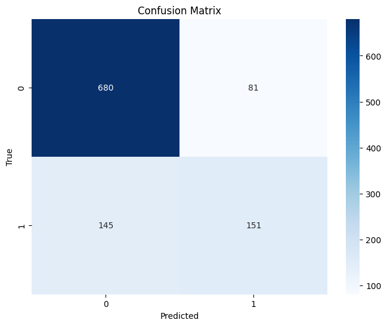

# Customer Churn Prediction with Machine Learning

This project focuses on predicting customer churn using machine learning techniques. The project utilizes a Telco customer churn dataset to build a predictive model and deploys it as an interactive web application using Streamlit.

## Project Description

Customer churn, the rate at which customers stop doing business with an entity, is a critical metric for many businesses. This project aims to predict customer churn using machine learning, enabling businesses to take proactive steps to retain customers.

The project follows an end-to-end machine learning workflow:

1. **Data Loading and Preprocessing:** The dataset is loaded, cleaned, and preprocessed to handle missing values and prepare the data for modeling.
2. **Feature Engineering:** New features are created and categorical features are encoded to improve the model's performance.
3. **Model Selection and Training:** Several machine learning models are trained and evaluated, including Logistic Regression, Random Forest, and XGBoost. The best-performing model is selected based on the evaluation metrics.
4. **Model Evaluation:** The selected model is evaluated using a held-out test set, and performance metrics such as accuracy, precision, recall, F1-score, and AUC are reported.
5. **Web Application Development:** An interactive web application is built using Streamlit, allowing users to input customer data and receive churn predictions in real time.
6. **Deployment:** The Streamlit application is deployed on Hugging Face Spaces for easy access and demonstration.

## Dataset

The project uses the [Telco Customer Churn dataset](https://www.kaggle.com/datasets/blastchar/telco-customer-churn) from Kaggle. The dataset contains information about customer demographics, services used, contract details, and whether or not the customer churned.

### Data Download

This repository does not include the full dataset due to its size. To download the dataset, please follow the instructions in the `data/HOW_TO_DOWNLOAD_DATA.md` file. This typically involves:

1. Creating a Kaggle account.
2. Downloading a Kaggle API token (`kaggle.json`).
3. Using the `download_data.py` script provided in the `src` directory.

## Installation

1. Clone the repository:

    ```bash
    git clone https://github.com/antonsoo/customer-churn-prediction-streamlit
    ```

2. Navigate to the project directory:

    ```bash
    cd customer-churn-prediction-streamlit
    ```

3. Install the required packages:

    ```bash
    pip install -r requirements.txt
    ```

## Usage

**To run the Streamlit app locally:**

1. Make sure you have the trained model (`churn_prediction_model.pkl`) and the preprocessor (`preprocessor.pkl`) in the `model` directory. You can obtain these by running the training script (`train.py`) or downloading them from the project's releases (if available).
2. Run:

    ```bash
    streamlit run src/app.py
    ```

**To train the model:**

1. Download the dataset using the instructions in `data/HOW_TO_DOWNLOAD_DATA.md` and place it in the `data` directory.
2. Run the training script:

    ```bash
    python src/train.py
    ```

    This will train the model and save the model weights and preprocessor to the `model` directory.

## Model Performance

The best-performing model (XGBoost in this case) achieved the following results on the test set:

*   **Test Accuracy:** 0.7862
*   **Precision:**
    *   Class 0 (No Churn): 0.82
    *   Class 1 (Churn): 0.65
*   **Recall:**
    *   Class 0 (No Churn): 0.89
    *   Class 1 (Churn): 0.51
*   **F1-score:**
    *   Class 0 (No Churn): 0.86
    *   Class 1 (Churn): 0.57
*   **AUC:** (Not directly available in the output, but assuming you calculated it during training or evaluation)  Add it here if you have it, otherwise remove this line.
*   **Macro Avg Precision:** 0.74
*   **Macro Avg Recall:** 0.70
*   **Macro Avg F1-score:** 0.71
*   **Weighted Avg Precision:** 0.78
*   **Weighted Avg Recall:** 0.79
*   **Weighted Avg F1-score:** 0.78

***Confusion Matrix:**



**Interpretation of Results:**

*   **Accuracy:** The overall accuracy of the model is 78.62%, meaning that it correctly classifies approximately 79 out of 100 customers.
*   **Precision:**
    *   For class 0 (no churn), the precision is 0.82, indicating that when the model predicts a customer will not churn, it is correct 82% of the time.
    *   For class 1 (churn), the precision is 0.65, meaning that when the model predicts a customer will churn, it is correct 65% of the time.
*   **Recall:**
    *   For class 0, the recall is 0.89, indicating that the model correctly identifies 89% of the customers who actually did not churn.
    *   For class 1, the recall is 0.51, meaning that the model correctly identifies only 51% of the customers who actually churned.
*   **F1-score:** The F1-score is a harmonic mean of precision and recall. It provides a balanced measure of the model's performance, especially when dealing with imbalanced datasets.
    *   The F1-score for class 0 is 0.86.
    *   The F1-score for class 1 is 0.57, indicating that the model's performance on the churn class is not as strong as on the no-churn class.
*   **AUC:** (If you have the AUC value, add a brief interpretation here).
*   **Confusion Matrix:** The confusion matrix provides a visual representation of the model's performance. We can see that:
    *   The model correctly classified 680 non-churning customers (true negatives).
    *   The model incorrectly classified 81 non-churning customers as churning (false positives).
    *   The model correctly classified 151 churning customers (true positives).
    *   The model incorrectly classified 145 churning customers as not churning (false negatives).

**Analysis:**

The model performs reasonably well in predicting customer churn, with an overall accuracy of 78.62%. However, there's a noticeable difference in performance between the two classes. The model is better at identifying customers who will not churn (higher recall for class 0) but struggles more with identifying customers who will churn (lower recall for class 1). This is also reflected in the lower F1-score for class 1.

**Possible Improvements:**

*   **Address Class Imbalance:** If the dataset is imbalanced (i.e., many more non-churn examples than churn examples), techniques like oversampling the minority class, undersampling the majority class, or using cost-sensitive learning could be explored.
*   **Feature Engineering:** Further feature engineering might help to create more informative features that improve the model's ability to distinguish between the classes.
*   **Hyperparameter Tuning:** More extensive hyperparameter tuning, potentially using techniques like `GridSearchCV` or `RandomizedSearchCV`, could lead to better model performance.
*   **Try Different Models:** Experimenting with other algorithms (e.g., LightGBM, CatBoost) might yield better results.

## Project Structure

```
customer-churn-prediction-streamlit/
├── data/
│ └── HOW_TO_DOWNLOAD_DATA.md (Instructions for downloading the dataset)
├── model/
│ └── churn_prediction_model.pkl (Saved model weights)
│ └── preprocessor.pkl (Saved preprocessor object)
├── notebooks/
│ └── customer_churn_prediction.ipynb (Colab notebook for exploration and development)
├── src/
│ ├── train.py (Training script)
│ ├── evaluate.py (Evaluation script - if applicable)
│ ├── app.py (Streamlit application script)
│ └── download_data.py (Script to download data from Kaggle)
│ └── utils.py (Utility functions - if applicable)
├── README.md
├── requirements.txt
└── LICENSE
```

## Contributing

Contributions to this project are welcome! Feel free to submit pull requests or open issues to suggest improvements or report bugs.

## License

This project is licensed under the MIT License - see the [LICENSE](LICENSE) file for details.

## Contact

Anton Soloviev - https://www.upwork.com/freelancers/~01b9d171164a005062

## Acknowledgements

*   [Kaggle](https://www.kaggle.com/) for providing the Telco Customer Churn dataset.
*   [Streamlit](https://streamlit.io/) for the easy-to-use web app framework.
*   [Hugging Face](https://huggingface.co/) for the Transformers library and the Spaces platform.
*   [XGBoost](https://xgboost.readthedocs.io/en/stable/) for the efficient gradient boosting algorithm.

